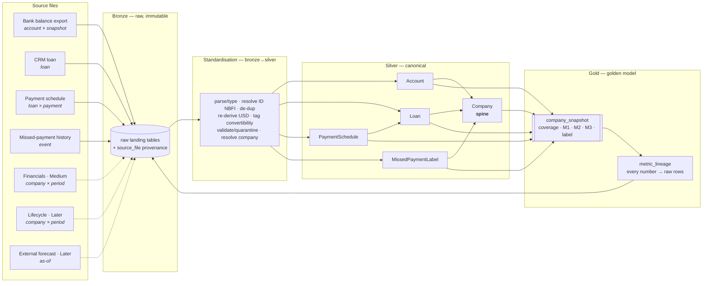

# Project Night's Watch — Ontology & Data Architecture

**Goal:** catch a portfolio company's cash trouble *before* it becomes a missed payment.
**Signal:** `coverage = expected transferable cash at the next payment (T1) ÷ cash to repay at T1`. Below **1.0** = at risk.

This document answers two questions directly:
1. **The golden level of detail** — what the early-warning model looks like at its richest (one row per *company per refresh*).
2. **The level of detail for each input** — the grain each source actually arrives at, and exactly what standardisation turns it into trustworthy data.

> Synthetic data only. One company (**Sahel AgriCorp**) mirrors the numeric distribution of the provided real bank export — **$9.31M total cash but only $796K transferable** — as the worked example.

---

## 1. The golden level of detail — `gold.company_snapshot`

The golden model is **one row per company per refresh**. Each row carries the signal, the three bank metrics, and the company-level summary fields the credit team ranks on. Nothing is invented: every number drills back to the raw rows that produced it (`gold.metric_lineage`).

| Field | Meaning | Metric |
|---|---|---|
| `company_id`, `refresh_ts` | grain: company × refresh | |
| `total_cash_usd` | all cash, re-derived to USD | |
| `transferable_cash_usd` | hard-currency cash actually usable for hard-currency debt | **M1** |
| `trapped_cash_usd` | restricted / non-convertible cash | |
| `burn_per_day_usd`, `runway_days` | from the transferable-cash history | **M2** |
| `projected_transferable_t1` | trend projected to the next payment date | **M3** |
| `cash_to_repay_t1`, `next_payment_date` | obligation at T1 (from loan + schedule) | |
| `coverage_ratio` | the signal: transferable (or M3) ÷ cash_to_repay_t1 | |
| `deteriorating` | sign of the coverage trend | |
| `prior_issue_count` | labelled past misses | |
| `principal_at_risk` | money the action is protecting (drives ranking) | |
| `ew_label` | **High / Medium / Low / None** | |
| `data_freshness_days` | a stale feed is itself a risk flag | |

### The three bank metrics (all derivable from the bank file alone)
- **M1 — Current transferable cash.** Sum of USD balances in the *transferable* convertibility class. For the worked example: **$796K** of $9.31M.
- **M2 — History of transferable cash.** M1 across stored snapshots → burn/day and runway.
- **M3 — Proxy of transferable cash at T1.** The M2 trend projected forward to the next repayment date.

---

## 2. The level of detail per input

Each source arrives at its **own grain**. The golden model only works once each is conformed to the spine (Company) and rolled up to *company × refresh*.

| Input | Phase | Grain (level of detail) | ID rule | Feeds |
|---|---|---|---|---|
| **Bank balance export** | Now | one row per **account per snapshot** | `account_key = COALESCE(native id, 'NBFI:'‖FI‖':'‖country‖':'‖currency)` | `silver.account` → M1/M2/M3 |
| **CRM loan structure** | Now | one row per **loan** | `loan_id = native CRM ref` | `silver.loan`, `silver.company` |
| **Payment schedule** | Now | one row per **loan × payment** | `loan_id + payment_date` | `silver.payment_schedule` → `cash_to_repay_t1` |
| **Missed-payment history** | Now | one row per **labelled event** | surrogate; `(company, loan, event_date)` | `silver.missed_payment_label` → `prior_issue_count` |
| **Balance sheet + cashflow** | Medium | one row per **company × period** | `company_id + period` | `silver.financials` → refines M3 |
| **Business lifecycle** | Later | one row per **company × period** | `company_id + period` | `silver.business_lifecycle` → forecast inflows |
| **External rate/cost forecast** | Later | one row per **as-of date** | `as_of` | `silver.external_forecast` → floating-rate `cash_to_repay_t1` |

### ID creation, per the bank file's reality
The provided export has **17 of 62 rows with no account identifier** — these are non-bank financial institutions (NBFIs) with no account number, and they hold **$2.57M = 28% of all cash**. Without a synthesized key they are invisible.

- Rule: `account_key = native id`, else `NBFI:<FI>:<country>:<currency>`.
- **Why currency is in the key:** FI + country *alone collides* — e.g. `FI-2C7313E6 / Nigeria` appears 4×, `FI-419C017F / Nigeria` 2×. Adding currency makes the key **unique across all 17 null rows** (verified against the file).
- Fallback: if country is also missing, use `FI + currency`.

---

## 3. Bronze → Silver: where the standardisation work happens

Bronze is raw and immutable (the drill-down target). Silver is one conformed schema. The work in between is the part that makes the data trustworthy — and is the part most people underestimate.

| # | Standardisation step | Applies to | Raw → canonical | Why it matters |
|---|---|---|---|---|
| 1 | **Parse & type** | all | text → numerics / dates (e.g. `'07/05/2026 13:55'` → date) | exports are all-text and inconsistent |
| 2 | **Resolve account ID (NBFI rule)** | bank | null id → `NBFI:FI:country:currency` | 28% of cash has no native id and would be dropped |
| 3 | **De-duplicate** | bank | repeated id (`ACC-E144BBED`) → one position; indistinguishable NBFI rows aggregated | double-counting understates risk |
| 4 | **Re-derive USD from FX** | bank | `balance_lcy × ref.fx_rate` — *source USD column ignored* | one controlled FX source keeps companies comparable |
| 5 | **Tag convertibility** | bank | currency → transferable / partial / restricted (IMF AREAER) | separates the usable $796K from the trapped $8.5M |
| 6 | **Validate, quarantine & freshness** | bank, CRM, schedule | bad/orphan/future rows → `validation_quarantine`; freshness = now − last_updated | honest by construction; stale feed = risk flag |
| 7 | **Resolve company** | bank, CRM | account/loan → `company_id` (the spine) | Gold aggregates per company |

---

## 4. Source → Golden model (flow)



---

## 5. Entity-relationship diagram (Company is the spine)

```mermaid
erDiagram
  COMPANY ||--o{ ACCOUNT : holds
  COMPANY ||--o{ LOAN : owes
  LOAN ||--o{ PAYMENT_SCHEDULE : "has payments"
  COMPANY ||--o{ MISSED_PAYMENT_LABEL : "labelled by"
  COMPANY ||--o{ COMPANY_SNAPSHOT : "scored each refresh"
  COMPANY ||--o{ ACTION_LOG : "acted on"
  COMPANY ||--o| FINANCIALS : "Medium"
  COMPANY ||--o| BUSINESS_LIFECYCLE : "Later"
  COMPANY_SNAPSHOT ||--o{ METRIC_LINEAGE : "drills to raw"

  COMPANY {
    text company_id PK
    text name
    text jurisdiction
    bool prior_distress_history
  }
  ACCOUNT {
    text account_key "native id OR NBFI:FI:country:currency"
    text company_id FK
    text currency
    text convertibility_class
    numeric balance_usd "re-derived from FX"
    date snapshot_ts
    bigint source_row_id FK "drill-down"
  }
  LOAN {
    text loan_id PK
    text company_id FK
    numeric principal
    text seniority
    numeric coupon_rate
    text cash_vs_pik
    date next_payment_date
  }
  PAYMENT_SCHEDULE {
    text loan_id FK
    date payment_date
    numeric amount_due
    bool is_pik
  }
  COMPANY_SNAPSHOT {
    text company_id FK
    date refresh_ts
    numeric transferable_cash_usd "M1"
    numeric projected_transferable_t1 "M3"
    numeric cash_to_repay_t1
    numeric coverage_ratio
    text ew_label
    numeric principal_at_risk
  }
}
```

The full field-level grain is in [`schema.sql`](schema.sql); the machine-readable version that powers the interactive diagram is in [`../spec/ontology.json`](../spec/ontology.json).

---

## 6. Action framework (what the team does with a warning)

Priority = money at stake × recoverability.

| Priority | When | Posture |
|---|---|---|
| **P1** Roll up sleeves | high principal + recoverable | intensive, hands-on |
| **P2** Structured workout | high principal + low recoverability | formal process, prepare options |
| **P3** Lightweight nudge | low principal + recoverable | cheap touch |
| **P4** Handle leanly | low principal + low recoverability | monitor; (Later) automate reversible actions |

Every action is written to `app.action_log` — building the labelled history that, in the Medium phase, calibrates the warning.
